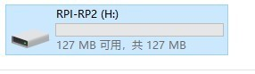
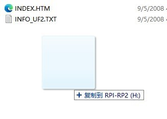

### firmware burning method

##### Press the boot button, plug the pico screen into the computer USB, pop up the disk drive letter

##### Just copy the firmware.uf2 file to the disk drive above

##### 